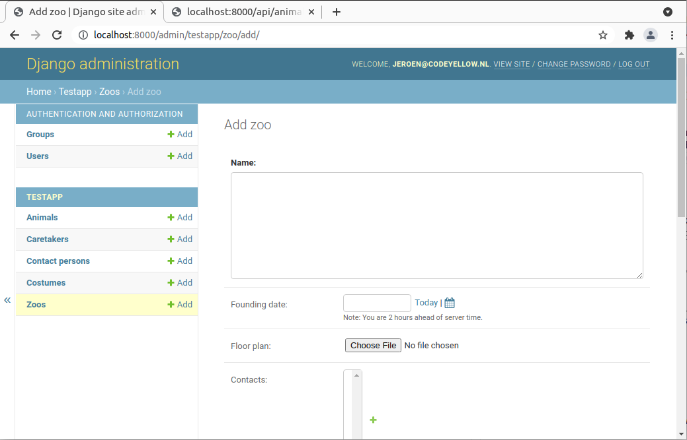

# Test Application

In order to test the implementation and to provide a minimal working example on how to use Binder, a demo application for administring a zoo is included in the `project/` folder. Note that this folder contains a symlink to the `testapp` folder that is used for unit testing Binder.

Start the application by running `docker-compose up` from the `project/` folder. The default Django admin panel is enabled, so you can easily create models using the web interface, see image below. However, feel free to dive into the terminal and use `curl`, see below.

You may need to create a superuser using the Django's command line utility, which is accessible by executing

`docker-compose exec web ./manage.py createsuperuser`

from the `project/` directory.

## Using `curl`
You can hit the api directly using `curl`. A simple PUT request can for example be made using

`curl -b 'sessionid=<sessionid>' -d @animal.json -X PUT localhost:8000/api/animal/1/`

Log in to the Django admin via a browser to obtain the `sessionid` cookie, which you may copy from the developer tools.  You may want to use the flag `-s` ('silent') to hide the progress bar of `curl`.
